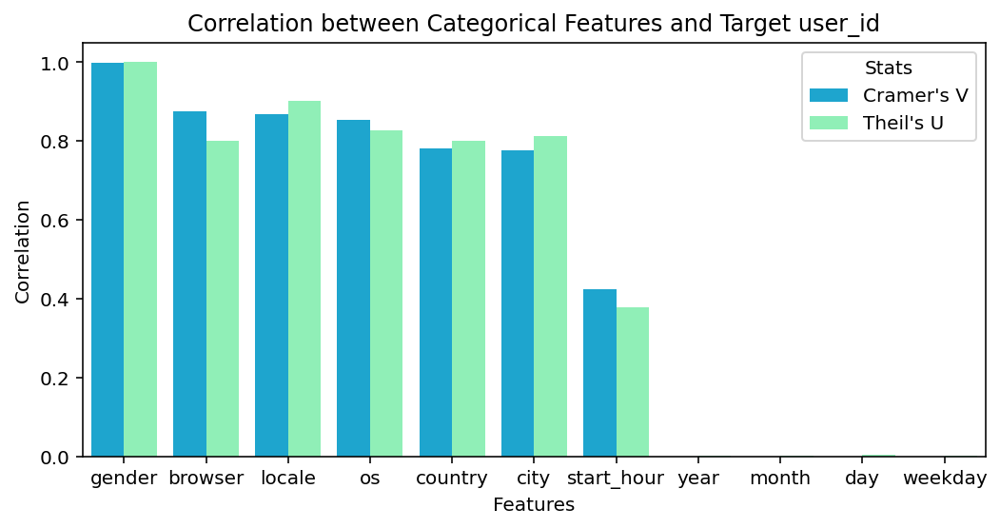

# Catch Joe



# Mission

Given a dataset of users activities of an online system, build a machine learning model that can identify a specific user with user_id=0 (codename Joe).

# Solution Summary

* [Presentation Slides](catch_joe.pptx)
* [Jupyter Notebook](https://nbviewer.org/github/0liu/machine-learning/blob/master/00_catch_joe/catch_joe.ipynb) [](https://colab.research.google.com/github/0liu/machine-learning/blob/master/00_catch_joe/catch_joe.ipynb) [](https://nbviewer.org/github/0liu/machine-learning/blob/master/00_catch_joe/catch_joe.ipynb)
* [Full Pipeline](catch_joe.py)
* The dataset is small, and skewed / imbalanced for binary classification
* Feature Extraction and Selection
  * Users' visited web sites are key features in this problem.
  * Two vectorization methods are used to extract the visited websites feature:
    * Vectorize by visiting length
    * Vectorize by visiting counts
  * N-Gram sequences up to 7-gram are used to preserve the orders, which improve much the model performance.
  * TF-IDF normalization follows each vectorization method.
* Models
  * Random forest, boosting and DNN are tested without much tuning.
  * All models can reach a F1 score about 0.89-0.9 on the test dataset, indicating a performance bound with these features.

# Dataset

Data file: [dataset.json](dataset.json)

The dataset contains data about user sessions that have been recorded over a period of time. Each session is represented by a JSON object with the following fields:

* "user_id" is the unique identifier of the user.
* "browser", "os", "locale" contain info about the software on the user's machine.
* "gender", "location" give analytics data about the user.
* "date" and "time" is the moment when the session started (in GMT).
* "sites" is a list of up to 15 sites visited during the session. For each site, the url and the length of visit in seconds are given.

# Solution Files

## Data analysis and modeling

* Presentation file
  * [catch_joe.pptx](catch_joe.pptx)
* Jupyter Notebook:
  * [catch_joe.ipynb](https://nbviewer.org/github/0liu/machine-learning/blob/master/00_catch_joe/catch_joe.ipynb) [](https://colab.research.google.com/github/0liu/machine-learning/blob/master/00_catch_joe/catch_joe.ipynb) [](https://nbviewer.org/github/0liu/machine-learning/blob/master/00_catch_joe/catch_joe.ipynb)
  * [catch_joe.org](catch_joe.org) (org-mode / emacs-jupyter)

## Full Pipeline

* [catch_joe.py](catch_joe.py) This is the main script to run on the test dataset and create the result.csv file..
* [feature_encode_pipeline.pkl](feature_encode_pipeline.pkl) The fitted feature encoding pipeline.
* [model.pkl](model.pkl) The predictive model to classify between Joe and other users.
* Usage:

  ```
  from catch_joe import CatchJoe
  cj = CatchJoe('./')  # Supply a path to save / load model files.
  cj.fit('./dataset.json')  # Fit model on train dataset. Save encoder / model files.
  cj.predict('./test.json')  # Predict on test dataset. Save result.csv. 
  
  
  ```

## Prediction Result File on the Test Dataset

* File [result.csv](result.csv) containing the predictions for the test dataset.
* Each line is the predicted label (0 = Joe, 1 = not Joe)