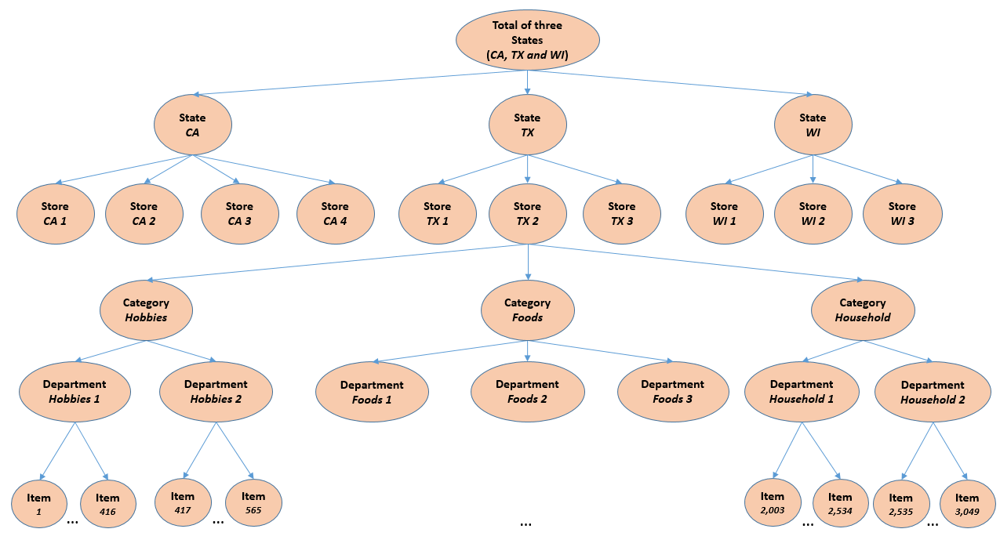

M5 Forecasting - Accuracy
=========================
Estimate the unit sales of Walmart retail goods
-----------------------------------------------

# Mission

[Kaggle Competition 2020 Mar-June](https://www.kaggle.com/c/m5-forecasting-accuracy/)

[Competitor's Guide](M5-Competitors-Guide.pdf)

This competition uses hierarchical sales data from Walmart, the world’s largest company by revenue, to forecast daily sales for the next 28 days. The data, covers stores in three US States (California, Texas, and Wisconsin) and includes item level, department, product categories, and store details. In addition, it has explanatory variables such as price, promotions, day of the week, and special events. Together, this robust dataset can be used to improve forecasting accuracy.

## Metric
- Weighted Root Mean Squared Scaled Error (RMSSE)

# Dataset ([data_input/](data_input/))
- [sales_train_validation.csv](data_input/sales_train_validation.csv) - Contains the historical daily unit sales data per product and store [d_1 - d_1913]
- [sales_train_evaluation.csv](data_input/sales_train_evaluation.csv) - Includes sales [d_1 - d_1941] (labels used for the Public leaderboard)
- [sell_prices.csv](data_input/sell_prices.csv) - Contains information about the price of the products sold per store and date.
- [calendar.csv](data_input/calendar.csv) - Contains information about the dates on which the products are sold.
- [sample_submission.csv](data_input/sample_submission.csv) - The correct format for submissions. Ids in submission file should be aligned to the sample index.

# Solution Files
- [m5_sales_accuracy_ensemble_gbt.ipynb](https://nbviewer.org/github/0liu/machine-learning/blob/master/01_m5-forecasting-accuracy/m5_sales_accuracy_ensemble_gbt.ipynb)
  For ensemble gradient boosting trees modeling, this is the all-in-one Jupyter notebook from data processing to model training and prediction.
- [m5_sales_accuracy_ensemble_gbt_kernel.py](m5_sales_accuracy_ensemble_gbt_kernel.py)
  Kaggle kernel to train ensemble GBT models.
- Preprocessed data files ([data_processed/](data_processed/))
  - [sales.pkl](data_processed/sales.pkl), [prices.pkl](data_processed/prices.pkl), [calendar.pkl](data_processed/calendar.pkl): preprocessed data from respective CSV files.
  - [sales_prices_calendar.pkl](data_processed/sales_prices_calendar.pkl) : Combination of the 3 files above
  - [sales_lag_roll_stats.pkl](data_processed/sales_lag_roll_stats.pkl): Lags of target (sales), and mean / stdev statistics of target for `lags=28` (the forecasting horizon), and rolling mean / stdev for `lags=(1, 7,14)` with `window lengths = (7, 14, 30, 60)`.
  - [sales_agg_stats.pkl](data_processed/sales_agg_stats.pkl): Mean / Stdev statistics of target at different aggregation levels from level 2 to 12, as defined in the official guide document.
- Result files ([results/](results/))
  - Trained models and predictions at each combination of aggregation levels and rolling stats types:
    - [rec_L3_store.pkl](results/rec_L3_store.pkl): Recursive, L3 by `store_id` only.
    - [rec_L8_store_cat.pkl](results/rec_L8_store_cat.pkl): Recursive, L8 by `store_id` and `cat_id`.
    - [rec_L9_store_dept.pkl](results/rec_L9_store_dept.pkl): Recursive, L9 by `store_id` and `dept_id`.
    - [nonrec_L3_store.pkl](results/nonrec_L3_store.pkl): Non-recursive, L3 by `store_id` only.
    - [nonrec_L8_store_cat.pkl](results/nonrec_L8_store_cat.pkl): Non-recursive, L8 by `store_id` and `cat_id`.
    - [nonrec_L9_store_dept.pkl](results/nonrec_L9_store_dept.pkl): Non-recursive, L9 by `store_id` and `dept_id`.
  - Submission file:
    - [submission.csv](results/submission.csv): Ensembled predictions with index aligned for final submission.
  
# Solution Summary
## Ensemble of local GBT regression models per aggregation levels / ID groups
  - Idea
    - Group items by an ID aggregation(grouping) level, for example `store_id` only, or `store_id` and `cat_id`.
    - Train a gradient boosting tree model locally for each group and each grouping level.
    - The final prediction is just the simple **ensemble (average)** of the predictions of the **local models**.
  - Grouping of items by IDs: 3 levels are picked out of the 12 aggregation levels defined in the official guide file, which are:
    - Level 3: Items grouped by `store_id` only. 10 groups (stores) totally.
    - Level 8: Items grouped by `store_id` and `cat_id`. 10 stores and 3 categories make 30 groups totally.
    - Level 9: Items grouped by `store_id` and `dept_id`. 10 stores and 7 departments make 70 groups totally.
  - 2 types of rolling statistics
    - Recursive: Rolling stats features include rolling mean/stdev of lagged targets of 28 days (`lag_days = 28`), as well as `lag_days = (1, 7, 14)`.
    - Non-Recursive: Rolling stats features only include rolling mean/stdev of lagged targets of 28 days (`lag_days = 28`).
  - There are (10 + 30 + 70) x 2 = **220 local models** totally. Depending on ID grouping level and rolling stats type, there are 6 local models trained for each item. So the final predictions for each item are the average of the predictions of the 6 local models.

## N-BEATS (Neural Basis Expansion Analysis for Time Series forecasting)
  - http://arxiv.org/abs/1905.10437
  - https://towardsdatascience.com/n-beats-beating-statistical-models-with-neural-nets-28a4ba4a4de8

# Feature Engineering

## ID groups
    'item_id', 'dept_id', 'cat_id', 'store_id', 'state_id'

## Explantory and derived features
    'instock_week'
    'sell_price', 'price_max', 'price_min', 'price_mean', 'price_std', 'price_norm', 
    'price_unique', 'item_unique', 'price_growth', 'price_deviation_month', 'price_deviation_year'
    'event_name_1', 'event_type_1', 'event_name_2', 'event_type_2',
    'snap_CA', 'snap_TX', 'snap_WI',
    'day', 'week', 'month', 'year', 'week_of_month', 'weekday', 'weekend'

## Time series statistics
    "sales_lag_28" - "sales_lag_42",
    "rolling_mean_7", "rolling_std_7", "rolling_mean_14", "rolling_std_14", "rolling_mean_30", "rolling_std_30",
    "rolling_mean_60", "rolling_std_60", "rolling_mean_180", "rolling_std_180",
    "rolling_mean_shift1_win7" win14, win30, win60,
    "rolling_mean_shift7_win7", win14, win30, win60
    "rolling_mean_shift14_win7", win14, win30, win60

## Target aggregating statistics
    "level2_state_id_mean",    "level2_state_id_std",
    "level3_store_id_mean",    "level3_store_id_std",
    "level4_cat_id_mean",    "level4_cat_id_std",
    "level5_dept_id_mean",    "level5_dept_id_std",
    "level6_state_id_cat_id_mean",    "level6_state_id_cat_id_std",
    "level7_state_id_dept_id_mean",    "level7_state_id_dept_id_std",
    "level8_store_id_cat_id_mean",    "level8_store_id_cat_id_std",
    "level9_store_id_dept_id_mean",    "level9_store_id_dept_id_std",
    "level10_item_id_mean",    "level10_item_id_std",
    "level11_item_id_state_id_mean",    "level11_item_id_state_id_std",
    "level12_item_id_store_id_mean",    "level12_item_id_store_id_std",

## Feature Importance

# Model Training
- Ensemble gradient boosting models are trined using LightGBM library.
- LightGBM parameters:
  - `boosting`= `"gbdt"`
  - `objective` = `"tweedie"`
  - `metric` = `"rmse"`
  - `bagging_fraction` = 0.5
  - `bagging_freq` = 1
  - `learning_rate` = 0.015
  - `num_leaves` = 2**8-1
  - `min_data_in_leaf` = 2**8-1
  - `feature_fraction` = 0.5
  - `max_bin` = 100
  - `num_iterations` = 3000
- N-Beats network can be trained using [MxNet](https://ts.gluon.ai/api/gluonts/gluonts.model.n_beats.html).

