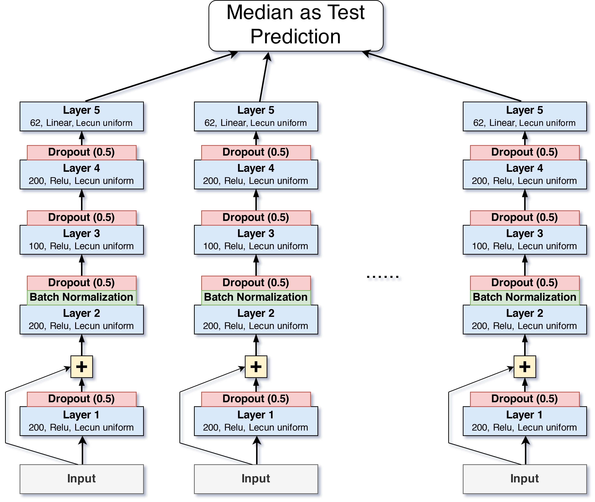

Web Traffic Time Series Forecasting
===================================
Forecast future traffic to Wikipedia pages
------------------------------------------

# Mission

[Kaggle Competition 2017 July-November](https://www.kaggle.com/c/web-traffic-time-series-forecasting/)

This competition aims at the problem of forecasting multiple time series, the future web traffic for approximately 145,000 Wikipedia articles.

## Metric
- SMAPE - [Symmetric mean absolute percentage error](https://en.wikipedia.org/wiki/Symmetric_mean_absolute_percentage_error)

# Dataset ([data_input/](data_input/))
- [train_1.csv](data_input/train_1.csv) [train_2.csv](data_input/train_2.csv) - Web traffic time series data from Wikipedia.org, Wikimedia.org, Mediawiki.org, 2015/07/01 - 2017/09/01.
- [key_1.csv](data_input/key_1.csv) [key_2.csv](data_input/key_2.csv) - Mapping of page-date combinations to Ids for submission.
- [sample_submission_1.csv](data_input/sample_submission_1.csv) [sample_submission_2.csv](data_input/sample_submission_2.csv) - The correct format for submissions.

# Solution Summary

- [EDA Notebook: web_traffic_forecasting_EDA.ipynb](https://nbviewer.org/github/0liu/machine-learning/blob/master/02_web_traffic_time_series_forecasting/web_traffic_forecasting_EDA.ipynb)    

- [Modeling Notebook: web_traffic_forecasting_DNN.ipynb](https://nbviewer.org/github/0liu/machine-learning/blob/master/02_web_traffic_time_series_forecasting/web_traffic_forecasting_DNN.ipynb)    

## Exploratory Data Analysis and Feature engineering
- Yearly seasonality
  The model is trained on 2016 data, test prediction on the same date range in 2017.
- log1p transformation on visits
  The orders of magnitude of visits are from 1 to 1e7, and 1+x on visits to address 0 views.
- Diff of weekly medians and the latest 16-week medians
  Besides categorical features (website, access, agents), the only numerical features for training are these median differences on the log1p tranformed visits.

## Bagging of DNN

- A bag of same DNN models that predict median differences.
- Each model has 4 hidden layers, with 100/200 units and Relu activation. The output layer is linearly activated. All layers use Lecun uniform initialization and dropout with rate 0.5.
- A **skip connection** from input is concatenated to the output of layer 1 output.
- The output of layer 2 is batch normalized.
- Each model is trained on a fold of data, and the models are selected based on the overall validation score.
- For test set prediction, the **median of the predictions** of all individual models are used as the final test labels.

## Wavenet (Todo)

