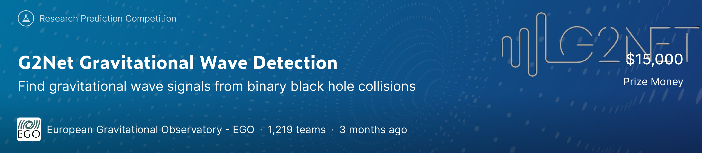

G2Net Gravitational Wave Detection
================================
Find gravitational wave signals from binary black hole collisions
----------------------------------------------------------------

# Mission

[Kaggle Competition 2021 June-September](https://www.kaggle.com/c/g2net-gravitational-wave-detection/)

This competition aims at the problem of forecasting multiple time series, the future web traffic for approximately 145,000 Wikipedia articles.

## Metric
- ROC-AUC - [Area under the ROC curve](http://en.wikipedia.org/wiki/Receiver_operating_characteristic)

# Dataset
- [train](data/train) - 560000 signal samples stored in numpy npy files. Each file contains a numpy array of shape (3, 4960), and each row corresponds to the 3 gravitational wave detection sites: LIGO Hanford, LIGO Livingston, and Virgo. The signal spancs 2 seconds and is sampled at 2,048 Hz.
- [test](data/test) - 226000 test signal samples stored in the same format of train dataset.
- [training_labels.csv](data/training_labels.csv) - The sample IDs and labels of training dataset.
- [sample_submission.csv](data/sample_submission.csv) - The sample IDs of test dataset.
- [TFRecord Dataset](https://www.kaggle.com/ningliu/g2net-gravitational-wave-detection-tfrecords): Small sample files are packed into large Tensorflow tfrecord files (20 for train and 10 for test), available for training with GPU on Kaggle Notebooks or Google Colab.
  
# Solution Files
- [EDA Notebook: G2Net_gravitational_wave_detection_EDA.ipynb](https://nbviewer.org/github/0liu/machine-learning/blob/master/03_G2Net_gravitational_wave_detection/G2Net_gravitational_wave_detection_EDA.ipynb)    

- [1-D CNN Modeling Notebook: G2Net_CNN1D_GeM_SGDW_Highpass.ipynb](https://nbviewer.org/github/0liu/machine-learning/blob/master/03_G2Net_gravitational_wave_detection/G2Net_CNN1D_GeM_SGDW_Highpass.ipynb)    

# Solution Summary
- Front-end
  - Scaling by 1e+20
  - Tukey window (Optinal. Rect window also works.)
  - High pass filter
    - 5-th order Butterworth filter
    - Cut-off frequency 20.43 Hz
- Deep learning
  - 1-D CNN architecture: Conv1D + Batch Normalization + Pooling. Modified from this paper: [H. Gabbard et al., Matching Matched Filtering with Deep Networks for Gravitational-Wave Astronomy, Phys. Rev. Lett. 120, 141103, April 6, 2018.](https://journals.aps.org/prl/pdf/10.1103/PhysRevLett.120.141103)
  - Max pooling layers are replaced with GeM pooling (Generalized Mean pooling).
  $$\textbf{e} = \left[\left(\frac{1}{|\Omega|}\sum_{u\in{\Omega}}x^{p}_{cu}\right)^{\frac{1}{p}}\right]_{c=1,\cdots,C} $$
  - Elu activations are replaced with Silu layers.
  - Training: 5 folds. Each fold with batch size 128, 20 Epochs.
  - Inference: The mean of the inferences by the stacking 5-fold models.